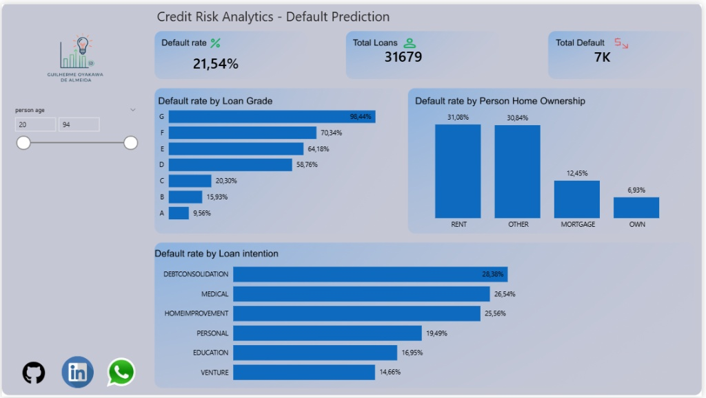

# 🏦 Credit Risk Analysis & Default Prediction

## 📌 Business Objective
In the banking sector, lending money to high-risk clients leads to significant financial losses. This project aims to build a Machine Learning classification model to identify potential defaulters (Class 1) before the credit is approved, allowing the institution to minimize risk and optimize its portfolio.

## 🛠️ Tools & Technologies
* **Language:** Python
* **Data Manipulation & Cleaning:** Pandas, NumPy
* **Machine Learning:** Scikit-Learn (k-NN, SVM, StandardScaler)
* **Data Visualization:** Matplotlib, Seaborn

## 🧠 The Approach
1. **Data Cleaning:** Handled missing values and removed irrelevant identifiers to ensure model integrity.
2. **Exploratory Data Analysis (EDA):** Identified key patterns, noting that higher interest rates strongly correlated with default rates.
3. **Feature Engineering:** Converted categorical variables into numeric formats (One-Hot Encoding) and scaled features using `StandardScaler` to prevent bias towards large numbers (like income).
4. **Model Evaluation:** Tested and compared **K-Nearest Neighbors (k-NN)** and **Support Vector Machine (SVM)**.

## 🏆 Business Results & Conclusion
The **k-NN model** outperformed the linear SVM. Because credit data is highly complex and overlapping (non-linear), a distance-based algorithm like k-NN was much more effective at identifying true defaults.

* **Best Model:** k-NN (k=5)
* **Recall (Class 1 - Defaulters):** 61%
* **Overall Accuracy:** 89%

By capturing 61% of potential defaulters accurately, this model provides a solid baseline for risk mitigation, potentially saving millions in bad loans.

## 📦 Interactive Dashboard

**[👉 Click here to interact with the Power BI Dashboard](https://app.powerbi.com/view?r=eyJrIjoiNzMyY2ZmYWItYWVjMy00ZDdmLWJiMjQtOTg4YjMxMDBiMjkwIiwidCI6ImRlNTM3NmEzLTdhOTEtNGM1NS1hOGQ5LTI0YjhkMTVlNWViMSJ9)**

*(If you are viewing this on mobile or without Power BI access, check the static preview below)*

