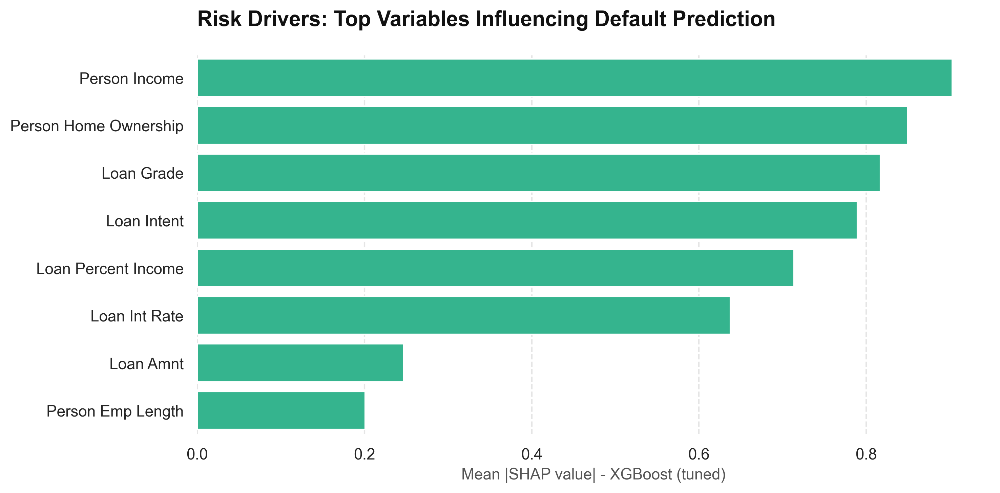
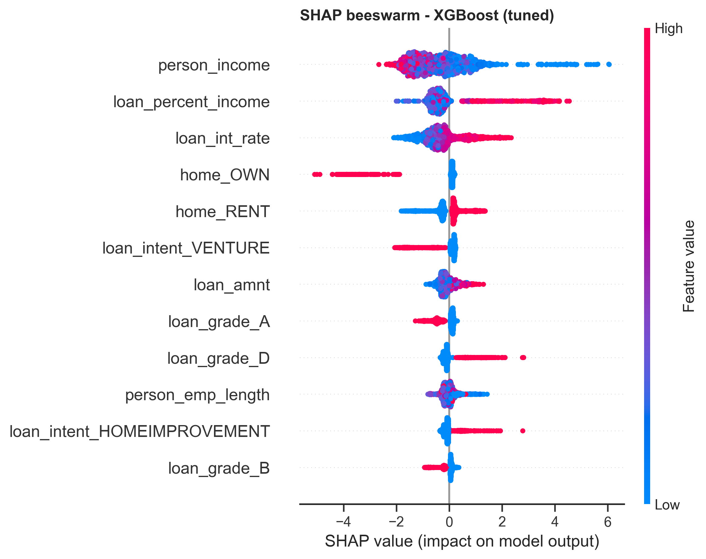
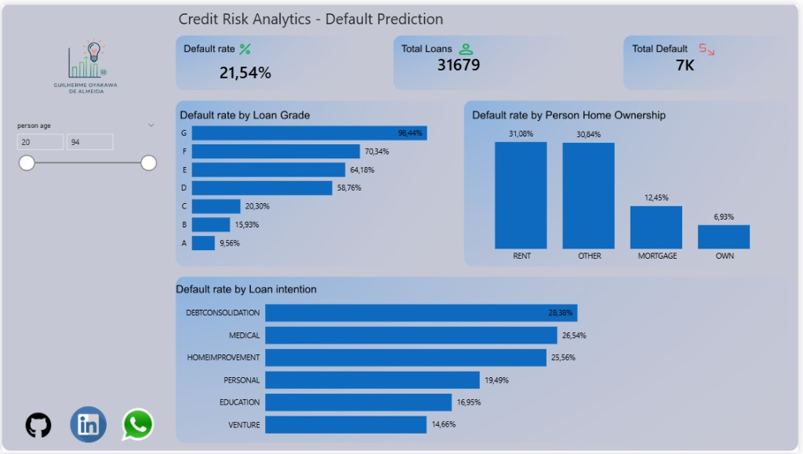

# Credit Risk Analysis & Default Prediction

**Author:** Guilherme Almeida

## Business problem
A lender loses money in two ways: approving a client who later defaults, and rejecting a good client who would have paid. This project estimates each applicant's **probability of default** so the credit team can approve, review or reject loans based on risk, and measures what that is worth. About 22% of the loans in the dataset defaulted.

Dataset: [Credit Risk Dataset](https://www.kaggle.com/datasets/laotse/credit-risk-dataset) (Kaggle), 32,581 loan records, 32,409 after cleaning.

## Two versions of the project

| | Original (repository root) | v2 (`v2/`) |
|---|---|---|
| Notebook | `Credit_risk_analysis.ipynb` | `v2/Credit_risk_analysis_v2.ipynb` |
| Models | k-NN and SVM | k-NN, Logistic Regression, Random Forest, XGBoost |
| Preprocessing | Median imputation and one-hot encoding on the full dataset before the split; scaler fitted on the training set | Leakage-free pipelines: imputation, scaling and encoding fitted on training data only |
| Evaluation | One train/test split | Stratified 5-fold cross-validation, tuned decision threshold, bootstrap confidence intervals |
| Extras | Power BI dashboard | Hyperparameter tuning, probability calibration, cost analysis, SHAP, robustness tests |

The original version is kept unchanged. Its best model was **k-NN (k=5)**, which caught 61% of defaulters at an overall accuracy of 89%.

## Version history (v1 vs v2)

Both versions are kept so the progress is measurable (git tags `v1.0` and `v2.0`). Full comparison: [docs/V1_vs_V2.md](docs/V1_vs_V2.md).

| | v1 | v2 |
|---|---|---|
| Defaulters caught (recall) at the default 0.5 cutoff | 61% | **80.5%** |
| Defaulters caught (recall) at a recall-first cutoff (0.35) | not tuned | 86.1% (precision 66.8%) |
| ROC-AUC | not measured | **0.950** |
| Preprocessing | before the split | leakage-free pipelines |
| Calibration and cost analysis | none | isotonic calibration, 81% lower simulated loss |
| Power BI | 1 descriptive page | 3 pages driven by model scores ([live v2 dashboard](https://app.powerbi.com/view?r=eyJrIjoiOTU0ODY1MTctOTY5NC00OTJhLWI2ZGEtZTM2MzlhNDdjNTg2IiwidCI6ImRlNTM3NmEzLTdhOTEtNGM1NS1hOGQ5LTI0YjhkMTVlNWViMSJ9)) |

The Power BI file for v2 is in `v2/powerbi/`.
## Results of v2
All numbers below come from the saved outputs of `v2/Credit_risk_analysis_v2.ipynb`, on the 30% held-out test set unless noted.

| Model | ROC-AUC | PR-AUC |
|---|---|---|
| k-NN | 0.865 | 0.735 |
| Logistic Regression | 0.870 | 0.708 |
| Random Forest | 0.933 | 0.886 |
| Random Forest (tuned) | 0.929 | 0.878 |
| **XGBoost (tuned)** | **0.950** | **0.907** |

- **The tuned XGBoost catches 80.5% of defaulters at the default 0.5 cutoff, against 61.1% for k-NN, with the same precision (83.1% vs 82.6%).** That is the gain of the model. Lowering the cutoff to the tuned 0.35 raises recall to **86.1%** (95% bootstrap CI 84.7% to 87.6%) but cuts precision to 66.8%: that is the gain of the cutoff, and it is a trade-off, not a free improvement. The threshold was chosen on out-of-fold training predictions.
- **Interactions drive the gain.** Tree models beat the linear and distance-based ones because default risk depends on combinations of variables (for example loan grade together with loan-to-income).
- **Probabilities are calibrated.** The raw model overstated risk (mean predicted default probability 29.2% against 21.9% observed). Isotonic calibration reduced the Brier score from 0.064 to 0.052 without hurting ranking (ROC-AUC 0.949).
- **Estimated value.** Under illustrative cost assumptions (60% loss given default, one year of forgone interest), using the model as a credit filter cuts the simulated loss from USD 13.97 million to USD 2.67 million, an **80.9% saving** versus approving every loan (95% CI 79.1% to 82.6%). A naive rule, "reject loan grades D to G", saves 37.3%.
- **The model is not just the lender's own score.** Without `loan_grade` and `loan_int_rate` the ROC-AUC falls from 0.950 to 0.904, so part of the signal is the lender's earlier pricing, but a substantial independent signal remains. Removing `person_age` costs almost nothing (ROC-AUC 0.948).
- **Risk bands separate clients well.** On the **whole portfolio** (out-of-fold scores of all 32,409 clients) the observed default rate is **2.1%** (Low, 17,364 clients), **11.4%** (Medium, 7,302) and **76.1%** (High, 7,743), with the High band holding about 82% of the expected loss (expected loss = PD x LGD x EAD). On the **held-out test set**, the model fitted on the training set gives 2.8% / 11.4% / **68.1%** (5,767 / 1,286 / 2,670 clients), and the out-of-fold scores of the test clients give 2.1% / 11.3% / 75.7%. For new clients, expect the first set.
- **Where the risk is.** Loans above 30% of income default 70.4% of the time, against 11.6% below 10%; a prior default on file raises the rate from 18.4% to 37.9%.




### Limitations
- **The labels look rule-generated, so the headline figures are an upper bound.** All 2,339 renters whose loan is at least 31% of their income defaulted, with no exception: 7.2% of the clients and 33.0% of all defaults (the notebook, section 8b, shows the check). A decision tree with two levels already reaches a cross-validated ROC-AUC of about 0.80, and without that group the out-of-fold ROC-AUC falls from 0.951 to 0.926. The ROC-AUC of 0.95 and the 81% simulated saving should be read as a ceiling for this dataset, not as an expectation for real data.
- The cost figures are illustrative and in US dollars; they are not in the data. The notebook includes a sensitivity analysis over them (the simulated saving ranges from 75.5% to 84.3% across the scenarios).
- 3,477 clients have a calibrated PD of exactly 1.0 (all of them defaulted) and 2,135 have exactly 0.0 (none defaulted). This is not a calibration bug: it follows from the near-deterministic labels described above (the renter group accounts for 2,213 of the 3,477), and no floor or cap was applied to the PDs.
- The data is a snapshot (no time dimension) and only approved loans have outcomes.
- Variables such as age may be restricted in real credit decisions (for example under GDPR Article 22 and anti-discrimination rules), so a compliance review would be needed before any real use.

## Interactive dashboard (original version)

**[Click here to interact with the Power BI Dashboard](https://app.powerbi.com/view?r=eyJrIjoiNzMyY2ZmYWItYWVjMy00ZDdmLWJiMjQtOTg4YjMxMDBiMjkwIiwidCI6ImRlNTM3NmEzLTdhOTEtNGM1NS1hOGQ5LTI0YjhkMTVlNWViMSJ9)**

*(If you are viewing this on mobile or without Power BI access, check the static preview below.)*



## How to run v2
1. Install the dependencies:
   ```bash
   pip install -r requirements.txt
   ```
2. **Dataset.** The notebook downloads it from Kaggle on the first run. Copy `v2/Kaggle_token.env.example` to `v2/Kaggle_token.env` and put your own token in it (never commit this file). Alternatively, download the dataset manually and place `credit_risk_dataset.csv` in `v2/`; the download is then skipped.
3. Open `v2/Credit_risk_analysis_v2.ipynb`, with `v2/` as the working directory, and run all cells. The first run takes a few minutes. The slow steps are cached in `v2/cache/`, so later runs are much faster; delete that folder to force a full re-run.
