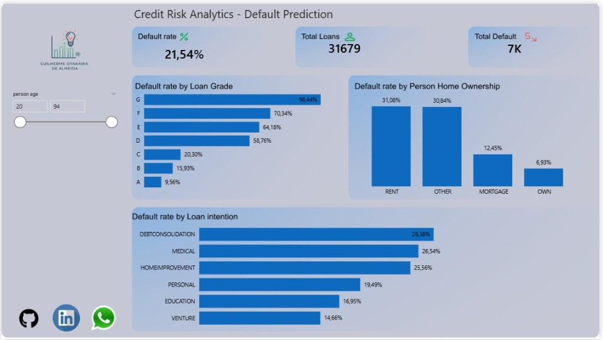
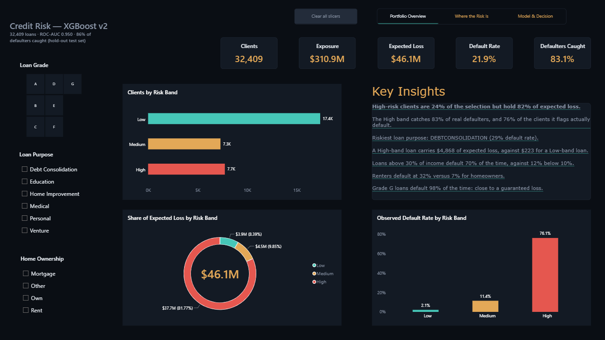
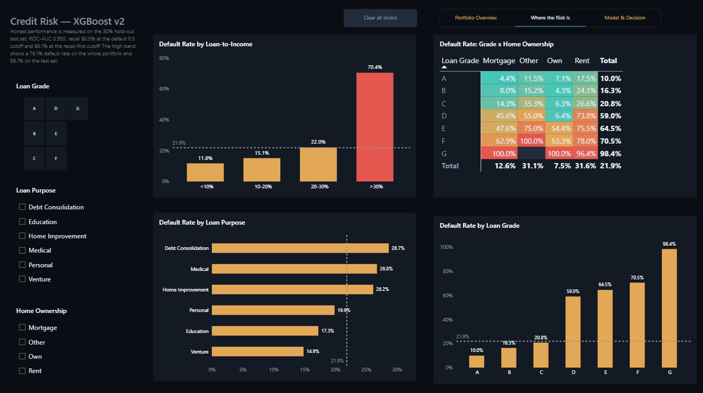
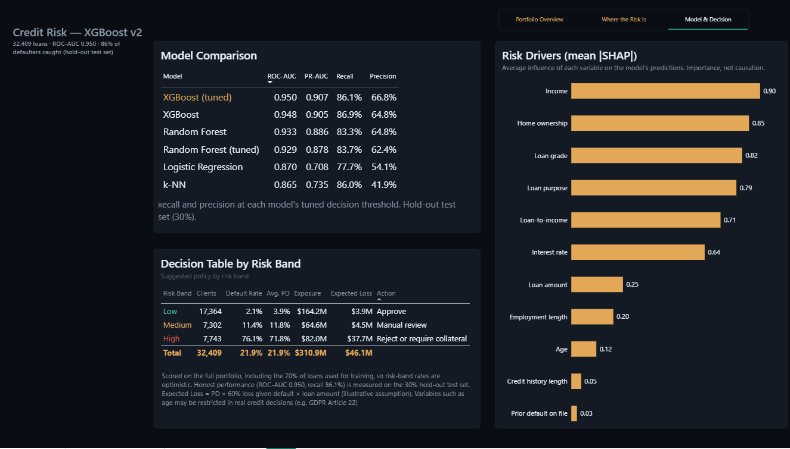

# Version history: v1 vs v2

This project exists in two versions so the progress is measurable. Nothing from v1 was deleted: its notebook and dashboard are still in the repository root, and the git tags `v1.0` and `v2.0` mark each state.

| | v1 (tag `v1.0`) | v2 (tag `v2.0`) |
|---|---|---|
| Notebook | `Credit_risk_analysis.ipynb` | `v2/Credit_risk_analysis_v2.ipynb` |
| Power BI | `Credit_risk_analysis.pbix` | `v2/powerbi/Credit_risk_analysis_v2.pbix` |

## Python model

| | v1 (original) | v2 (rebuilt) |
|---|---|---|
| Data after cleaning | 31,679 loans | 32,409 loans |
| Models compared | k-NN, linear SVM | k-NN, Logistic Regression, Random Forest, XGBoost (tuned) |
| Preprocessing | Imputation and encoding on the full dataset before the split | Leakage-free pipelines, fitted on training data only |
| Evaluation | One train/test split | Stratified 5-fold cross-validation, tuned threshold, bootstrap confidence intervals |
| Best model | k-NN (k=5) | XGBoost (tuned) |
| **Defaulters caught (recall) at the default 0.5 cutoff** | **61%** | **80.5%** |
| Precision on defaulters at the default 0.5 cutoff | 85% | 83.1% |
| Overall accuracy at the default 0.5 cutoff | 89% | 92.2% |
| Defaulters caught (recall) at a recall-first cutoff (0.35) | not tuned | 86.1% (95% CI 84.7% to 87.6%) |
| Precision and accuracy at the recall-first cutoff | not tuned | 66.8% and 87.6% |
| **ROC-AUC** | not measured | **0.950** |
| Probability calibration | none | isotonic (Brier score 0.064 to 0.052) |
| Explainability | none | SHAP |
| **Business value** | not quantified | **81% lower simulated loss** (USD 13.97M to 2.67M) |
| Robustness checks | none | ablation tests (loan grade, interest rate, age) |

**Fair comparison.** The same k-NN rebuilt in v2 at the same 0.5 cutoff catches 61.1% of defaulters with 82.6% precision and 88.7% accuracy, essentially the v1 result. So the leakage-free methodology makes the estimate honest but does not by itself raise recall. The improvement has two separate sources:
- **The model:** at the same 0.5 cutoff the tuned XGBoost catches 80.5% of defaulters (61.1% to 80.5%) with the same precision (82.6% to 83.1%).
- **The cutoff:** lowering it to 0.35 raises recall from 80.5% to 86.1%, while precision falls from 83.1% to 66.8%. This is a deliberate trade-off (reviewing more clients is cheaper than missing defaulters), not a free gain; any model gains recall this way (k-NN reaches 86.0% at a 0.05 cutoff, with 41.9% precision).

The v1 figures come from the saved outputs of `Credit_risk_analysis.ipynb` (k-NN: precision 0.85, recall 0.61, accuracy 0.89; SVM: recall 0.56, accuracy 0.87; test set of 9,504 loans). The v2 figures come from `v2/Credit_risk_analysis_v2.ipynb` and `v2/model_comparison.csv`.

## Power BI dashboard

| | v1 (original) | v2 (rebuilt) |
|---|---|---|
| Pages | 1 | 3 (Portfolio Overview, Where the Risk Is, Model & Decision) |
| Data behind it | raw loan data | every loan scored by the model: default probability, risk band, expected loss |
| What it answers | where did defaults happen? | who is likely to default, what would it cost, and what should the lender do? |
| Interactivity | age slider | loan grade, purpose and home-ownership filters, page tabs, clear-all button |
| Insights | static visuals | dynamic text that updates with every filter |
| Model transparency | none | model comparison table and SHAP risk drivers |
| Design | default light layout | dark theme with a semantic colour code for risk |

| v1 | v2 |
|---|---|
|  |  |

Live dashboards:
- v1: https://app.powerbi.com/view?r=eyJrIjoiNzMyY2ZmYWItYWVjMy00ZDdmLWJiMjQtOTg4YjMxMDBiMjkwIiwidCI6ImRlNTM3NmEzLTdhOTEtNGM1NS1hOGQ5LTI0YjhkMTVlNWViMSJ9
- v2: https://app.powerbi.com/view?r=eyJrIjoiOTU0ODY1MTctOTY5NC00OTJhLWI2ZGEtZTM2MzlhNDdjNTg2IiwidCI6ImRlNTM3NmEzLTdhOTEtNGM1NS1hOGQ5LTI0YjhkMTVlNWViMSJ9

## Notes on the v2 dashboard
- The ROC-AUC of 0.95 and the 81% simulated saving are an upper bound for this dataset: its labels look rule-generated (all 2,339 renters with a loan of at least 31% of their income defaulted; see section 8b of the notebook).
- Risk bands: Low (PD below 8.5%), Medium (8.5% to 17%), High (17% or more).
- Expected Loss = PD x 60% loss given default x loan amount (illustrative assumption).
- The dashboard scores the full portfolio, including the 70% of loans used for training, so rates by risk band are optimistic. Honest performance (ROC-AUC 0.950; recall 80.5% at the 0.5 cutoff and 86.1% at the recall-first cutoff) is measured on the 30% hold-out test set.
